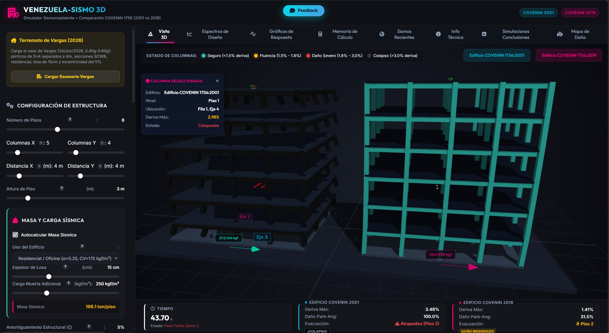

# VZLA-SISMO 3D: Simulador Sismorresistente Comparativo (COVENIN 1756)

[](https://github.com/metantonio/venezuela-sismo/blob/master/LICENSE)
[](https://github.com/metantonio/venezuela-sismo/issues)



**VENEZUELA-SISMO 3D** es una aplicación web interactiva de ingeniería estructural y sismorresistente diseñada para comparar dinámicamente el comportamiento de edificaciones de concreto armado diseñadas bajo las normativas venezolanas **COVENIN 1756:2001** (Norma Tradicional) y **COVENIN 1756:2019** (Norma Moderna).

La herramienta combina simulaciones dinámicas por el método de Newmark-$\beta$ con una interfaz gráfica en 3D (Three.js) que representa el balanceo, la torsión en planta y el colapso progresivo de las estructuras ante sismos sucesivos de gran magnitud.

🌐 **Demo en vivo:** [https://metantonio.github.io/venezuela-sismo](https://metantonio.github.io/venezuela-sismo)

---

## 🚀 Características Principales

### 1. Modelado Dinámico e Histerético en Tiempo Real
*   **Resolvedor MDOF:** Integra las ecuaciones de movimiento a nivel de entrepiso usando el algoritmo de aceleración promedio constante de **Newmark-$\beta$** ($\beta = 0.25$, $\gamma = 0.50$).
*   **No Linealidad Bilineal:** Incorpora un modelo elastoplástico con endurecimiento por deformación ($\alpha_p = 5\%$ en 2001 y $3\%$ en 2019).
*   **Modelo de Degradación de Rigidez y Resistencia:** Emplea el **Índice de Daño de Park-Ang** para reducir la rigidez y resistencia lateral en función de la deformación máxima y la energía disipada acumulada.

### 2. Secciones Físicas e Inercias Transformadas
*   **Inercias de Columnas:** Inercia transformada de secciones rectangulares de concreto armado considerando el aporte de la armadura longitudinal simétrica ($I_{c,\text{eff}}$).
*   **Inercias Agrietadas de Vigas:** Cálculo del eje neutro agrietado ($x_{na}$) y la inercia agrietada de la viga ($I_{cr}$) bajo flexión simple en servicio.
*   **Masa por Área Tributaria:** Corrección automática de masa según la planta del edificio:
    $$m = m_{\text{ref}} \times \left(0.3 + 0.7 \times \frac{\text{Área}}{25}\right)$$

### 3. Filosofía de Diseño Columna Fuerte - Viga Débil (SCWB)
*   **Cálculo de Momentos Nominales:** Evalúa $M_{n,\text{vig}}$ en vigas doblemente armadas y $M_{n,\text{col}}$ en columnas bajo carga axial promedio.
*   **Verificación en Nudos:** Compara $\sum M_{n,\text{col}} / \sum M_{n,\text{vig}} \ge 1.2$.
*   **Mecanismo de Falla:** Si se cumple el criterio, las columnas se protegen y se reduce la velocidad de degradación lateral en un $60\%$. De lo contrario, se penaliza simulando un mecanismo frágil de "piso blando" en columnas.

### 4. Efecto de Torsión en Planta y Daño Local
*   **Acoplamiento de Torsión:** El giro en planta ($\theta_z$) se acopla al desplazamiento traslacional basándose en la excentricidad torsional ($e_a$) y el radio de giro polar ($r_p$).
*   **Daño por Elemento ($D_{\text{max}}$):** Rastrea individualmente la deriva en las columnas perimetrales (esquinas) sometidas a torsión amplificada para dictaminar la falla local de la columna y gatillar el colapso del edificio.

### 5. Doble Sismo Sucesivo e Independiente
*   **Sismos No Correlacionados:** Simula dos terremotos sucesivos (ej. Sismo 1 de M7.1 en calma y Sismo 2 de M7.5). Cada evento se genera usando ruido blanco independiente filtrado con parámetros de Kanai-Tajimi específicos según el tipo de suelo.

### 6. Visualización 3D y Simulación de Evacuación
*   **Espectros de Respuesta:** Gráfica interactiva de los espectros de diseño elásticos y de diseño reducidos según las especificaciones de COVENIN 2001 y 2019.
*   **Three.js Estructural:** Visualiza la oscilación, la torsión de losas, y la formación de rótulas plásticas en los extremos de cada columna (amarillo para fluencia, rojo para daño severo).
*   **Colapso Animado:** Animación física de la caída de losas y generación de polvo/escombros por gravedad cuando falla algún piso.
*   **Agente de Evacuación:** Ocupantes virtuales en el techo que inician el descenso tras un tiempo de reacción y cuya vida corre peligro si el edificio colapsa antes de que salgan a la calle.

### 7. Exportación a PDF de la Memoria de Cálculo
*   **Reporte Completo:** Genera un documento en limpio que incluye la cabecera del proyecto, la fecha de generación, el resumen de todos los parámetros de entrada de geometría y diseño sísmico de cada norma, y las tablas del solver dinámico y deriva de columnas.
*   **Estilos de Alto Contraste:** Hojas de estilo `@media print` optimizadas para imprimir en blanco y negro ahorrando tinta, sin elementos interactivos de la aplicación.

---

## 🛠️ Tecnologías Utilizadas

1.  **Estructura y UI:** HTML5 semántico con diseño moderno responsive.
2.  **Estilos (CSS):** Vanilla CSS con diseño Glassmorphic Premium y Modo Oscuro nativo. Soporta variables seguras (`env(safe-area-inset-*)`) para dispositivos iOS (iPhone/iPad con Notch o Home Indicator) y Dynamic Viewport Height (`100dvh`).
3.  **Visualización 3D:** Three.js (WebGL) con OrbitControls, luces y sombras suaves de tipo PCFSoftShadowMap.
4.  **Gráficos:** Chart.js para las curvas espectrales, la historia de aceleración en el terreno y desplazamientos de techo, y las curvas de histéresis cortante-deriva.

---

## ⚙️ Configuración y Ejecución Local

Dado que el simulador está construido puramente del lado del cliente en vanilla HTML/JS/CSS, **no requiere ningún proceso de compilación** ni dependencias pesadas de backend.

Para ejecutarlo localmente:

1.  Clona el repositorio:
    ```bash
    git clone https://github.com/metantonio/venezuela-sismo.git
    cd venezuela-sismo
    ```
2.  Inicia un servidor web local simple. Por ejemplo:
    *   Usando **Python 3**:
        ```bash
        python -m http.server 8000
        ```
    *   Usando **Node.js** (http-server):
        ```bash
        npx http-server -p 8000
        ```
3.  Abre en tu navegador favorito:
    ```
    http://localhost:8000
    ```

---

## 📊 Comparación Normativa: COVENIN 2001 vs 2019

El simulador implementa las siguientes diferencias técnicas clave dictadas por la evolución de la norma COVENIN 1756:

| Concepto Técnico | COVENIN 1756:2001 | COVENIN 1756:2019 |
| :--- | :--- | :--- |
| **Espectro de Diseño** | Formas espectrales rígidas asociadas a perfiles S1, S2, S3 y S4 en base a $A_0$. | Formulación moderna que parametriza períodos cortos ($A_0$) y de 1s ($A_1$) según microzonas. |
| **Límite de Deriva de Colapso** | $\Delta_{\text{lim}} = 3.5\%$ (menos estricto ante flexión no lineal en el simulador). | $\Delta_{\text{lim}} = 4.5\%$ (ampliado debido a los requerimientos modernos de ductilidad). |
| **Severidad de Degradación** | Completa ($100\%$ de la severidad elegida), representando el confinamiento tradicional. | Reducida al $50\%$, representando el excelente confinamiento y ductilidad del detallado ND3. |
| **Flexibilidad de Vigas** | Sintonizado simple. | Considera coeficientes de rigidez basados en inercia agrietada de viga ($I_{cr}$) y flexibilidad relativa $\kappa$. |

---

## Comprobación de coordenadas en building.json


Script creado: tools/verificar-edificios.js

Sin dependencias (Node ≥18, que ya tienes). Uso:

```bash
node tools/verificar-edificios.js                  # verificación completa + revisión interactiva
node tools/verificar-edificios.js --no-geocode     # solo duplicados (rápido, sin internet)
node tools/verificar-edificios.js --solo-reporte   # solo informa, no pregunta ni toca nada
node tools/verificar-edificios.js --limit 20       # geocodifica solo 20 (para probar)
```

1. Comprobación de coordenadas — Consulta Nominatim (OpenStreetMap) con nombre + dirección, restringido a Venezuela, y compara contra tus lat/lng guardadas (clasifica: ok ≤200 m, sospechoso, discrepante, no encontrado). Respeta la política de uso (1 req/s, User-Agent identificado) y guarda caché en tools/cache-geocodificacion.json: la primera corrida tarda ~12–15 min con 667 edificios, pero las siguientes solo consultan los edificios nuevos. Escribe el detalle en tools/reporte-geocodificacion.json.

⚠️ Matiz importante: en Venezuela OSM rara vez tiene el edificio exacto — a menudo geocodifica a nivel de calle o urbanización. Un "discrepante" no significa que tu coordenada esté mal, sino que OSM no pudo confirmarla (el reporte incluye qué encontró OSM para que juzgues). Es una herramienta de cribado, no de verdad absoluta.

2. Duplicados con revisión caso a caso — Agrupa por: mismas coordenadas (<10 m), nombre casi idéntico + cercanía, o nombre casi idéntico + misma dirección (normaliza tildes, mayúsculas y prefijos como "Edificio/Residencias/Torre").

### Aplicar Coordenadas Confirmadas por OSM

Script creado: `tools/aplicar-coordenadas-osm.js`

Permite tomar los 137 edificios confirmados por OpenStreetMap (estado `ok` con distancia ≤200 m) del reporte existente y actualizar sus coordenadas en `buildings.json`.

```bash
node tools/aplicar-coordenadas-osm.js             # Modo simulación (Dry Run, muestra cambios sin modificar)
node tools/aplicar-coordenadas-osm.js --aplicar   # Aplica cambios y genera respaldo automático buildings.backup-*.json
node tools/aplicar-coordenadas-osm.js --umbral-m 100 --aplicar # Exige umbral estricto <=100m
```
---

## 📝 Autor e Información Académica

Este proyecto ha sido desarrollado como una herramienta educativa e interactiva para ingenieros civiles, estudiantes de ingeniería estructural y profesionales interesados en la sismología de la región de Venezuela.

*   **Desarrollado por:** Ing. Antonio Luis III Martínez B.
*   **Contexto:** Universidad Central de Venezuela (UCV) / Ingeniería Estructural.

---

## 📄 Licencia

Este proyecto está bajo una Licencia MIT modificada para fines no comerciales y con requerimiento de atribución obligatoria. Se permite su uso y modificación siempre y cuando no se use comercialmente y se nombre al autor original: **Antonio Luis III Martínez B.** Para más detalles, consulta el archivo [LICENSE](LICENSE).
